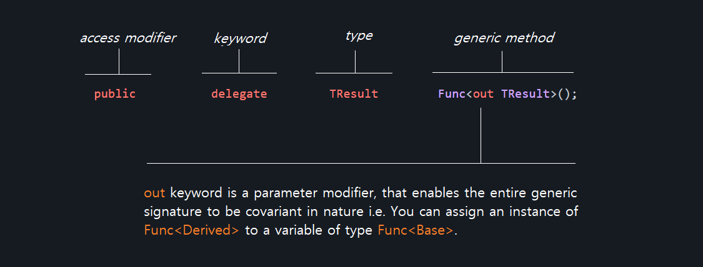

# Day One - Microsoft C# Func<TResult> Delegate

  ### What are Delegates?
  
  A delegate is a type that represents references to methods with a particular parameter list and return type. When you instantiate a delegate, you can associate its instance with   any method with a compatible signature and return type
  
  ### Func<TResult> Delegate
  ```c#
  public delegate TResult Func<out TResult>();
  ```
  
  Encapsulates a method that has no parameters and returns a value of the type specified by the TResult parameter. Delegate are popularly called callbacks, first order functions     and etc in some other programming languages. They simply help to stand as anonymous function without explicitly being defined. We can used them to notify a task as a predicate.   Delegate Func<TResult> can stand out as argument which enables writing of more organized code. 
  
  ### Example - 01
  ```c#
      using System;

      static class Func1
      {
         public static void Main()
         {
            // Note that each lambda expression has no parameters.
            LazyValue<int> lazyOne = new LazyValue<int>(() => ExpensiveOne());
            LazyValue<long> lazyTwo = new LazyValue<long>(() => ExpensiveTwo("apple"));

            Console.WriteLine("LazyValue objects have been created.");

            // Get the values of the LazyValue objects.
            Console.WriteLine(lazyOne.Value);
            Console.WriteLine(lazyTwo.Value);
         }

         static int ExpensiveOne()
         {
            Console.WriteLine("\nExpensiveOne() is executing.");
            return 1;
         }

         static long ExpensiveTwo(string input)
         {
            Console.WriteLine("\nExpensiveTwo() is executing.");
            return (long)input.Length;
         }
      }

      class LazyValue<T> where T : struct
      {
         private Nullable<T> val;
         private Func<T> getValue;

         // Constructor.
         public LazyValue(Func<T> func)
         {
            val = null;
            getValue = func;
         }

         public T Value
         {
            get
            {
               if (val == null)
                  // Execute the delegate.
                  val = getValue();
               return (T)val;
            }
         }
      }
  ```
  ### Let's break it down
  
 
  In other word ```c# out``` keyword already marked TResult of any type to assignable and modifiable unlike ```c# in ``` and ```c# ref ```. You can read more about the             difference in these parameter modifier here : https://docs.microsoft.com/en-us/dotnet/csharp/language-reference/keywords/out-parameter-modifier.
  
  
    ### Func<TResult> Delegate
  ```c#
  public delegate TResult Func<in T, out TResult>();
  ```
  
  ### Example - 02 Func<in T, out TResult>()
  ```c#
    using System;
    using System.Collections.Generic;
    using System.Linq;

    namespace ConsoleApp
    {
        public class Program
        {
            static void Main(string[] args)
            {
                string[] months = { "january", "february", "march", "april", "may", "june", "july", "august", "september", "october", "november", "december" };

                Func<string, string> selector = str => str.ToUpper();

                IEnumerable<string> capitalizedMonths = months.Select(selector);

                foreach (var month in capitalizedMonths)
                {
                    System.Console.WriteLine(month);
                }
            }
        }
    }
  ```
