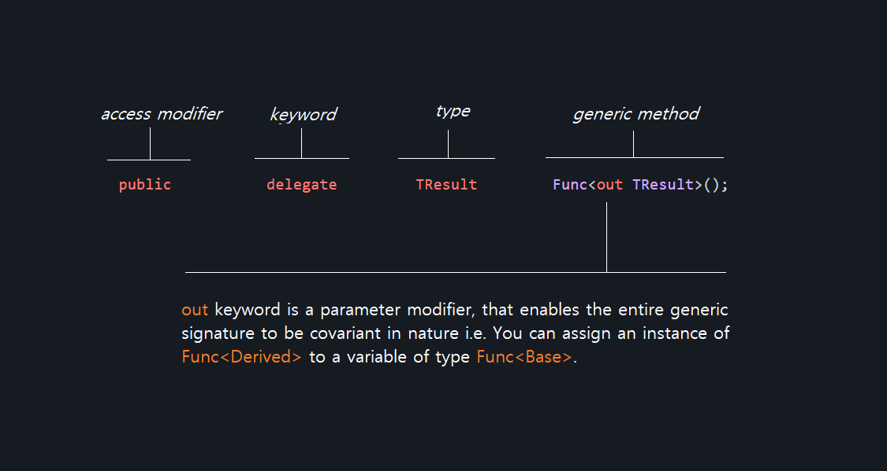

# Day 001 - Microsoft C# Func<TResult> Delegate

  ### What are Delegates?
  
  A delegate is a type that represents references to methods with a particular parameter list and return type. When you instantiate a delegate, you can associate its instance with   any method with a compatible signature and return type
  
  ### Func<TResult> Delegate
  ```c#
  public delegate TResult Func<out TResult>();
  ```
  
  Encapsulates a method that has no parameters and returns a value of the type specified by the TResult parameter. Delegate are popularly called callbacks, first order functions     and etc in some other programming languages. They simply help to stand as anonymous function without explicitly being defined. We can used them to notify a task as a predicate.   Delegate Func<TResult> can stand out as argument which enables writing of more organized code. 
  
  ### Example - 01
  ```c#
      using System;
      using System.Linq;

      namespace ConsoleApp
      {
          public class Program
          {
              delegate string CustomSelector(string value, int index);
              delegate TResult CustomSelectorTwo <in T, in R, out TResult>(T value, R index);

              static void Main(string[] args)
              {
                  // Note that each lambda expression has no parameters.
                  LazyValue<int> lazyOne = new LazyValue<int>(() => ExpensiveOne());
                  LazyValue<long> lazyTwo = new LazyValue<long>(() => ExpensiveTwo("apple"));

                  Console.WriteLine("LazyValue objects have been created.");

                  // Get the values of the LazyValue objects.
                  Console.WriteLine(lazyOne.value);
                  Console.WriteLine(lazyTwo.value);
  
                  Console.ReadLine();
              }

              private static string SelectorMethod (string value, int index)
              {
                  return value.ToUpper();
              }

              static int ExpensiveOne()
              {
                  Console.WriteLine("\nExpensiveOne() is executing.");
                  return 1;
              }

              static long ExpensiveTwo(string input)
              {
                  Console.WriteLine("\nExpensiveTwo() is executing.");
                  return (long)input.Length;
              }
          }

          class LazyValue<T> where T : struct // This is called constraint, it's been constrained down to a value type
          {
              private Nullable<T> _value; // You can either use Nullable<T> Generic or T? and both still have access to the same method .GetValueOrDefault
              private Func<T> _getValue;
              public T value
              {
                  get
                  {
                      if(_value == null)
                      {
                          _value = _getValue();
                      }
                      return (T)_value;
                  }
              }

              public LazyValue(Func<T> func)
              {
                  _value = null;
                  _getValue = func;
              }
          }
      }

  ```
  ### Let's break it down
  
 
  In other word ```c# out``` keyword already marked TResult of any type to assignable and modifiable unlike ```c# in ``` and ```c# ref ```. You can read more about the             difference in these parameter modifier here : https://docs.microsoft.com/en-us/dotnet/csharp/language-reference/keywords/out-parameter-modifier.
  
  
  ### Func<T, TResult> Delegate
  ```c#
  public delegate TResult Func<in T, out TResult>();
  ```
  
  ### Example - 02 Func<in T, out TResult>()
  ```c#
    using System;
    using System.Collections.Generic;
    using System.Linq;

    namespace ConsoleApp
    {
        public class Program
        {
            static void Main(string[] args)
            {
                string[] months = { "january", "february", "march", "april", "may", "june", "july", "august", "september", "october", "november", "december" };

                Func<string, string> selector = str => str.ToUpper();

                IEnumerable<string> capitalizedMonths = months.Select(selector);

                foreach (var month in capitalizedMonths)
                {
                    System.Console.WriteLine(month);
                }
            }
        }
    }
  ```
  
  ### Remember Enumerable.Select() has second overload method : 
  
  ```c#
        public static IEnumerable<TResult> Select<TSource, TResult>(this IEnumerable<TSource> source, Func<TSource, int, TResult> selector);
  ```
  
  The delegate Func<TSource, int, TResult> returns TResult takes in TSource type and can be rewrite in :
  
  ```c#
    Func<string, int, string> selector = delegate (string str, int index) { return SelectorMethod(str, index); };
  
    private static string SelectorMethod (string value, int index)
    {
        //use index for anything
        return value.ToUpper();
    }
  ```


# Day 002 - Microsoft C# Action<T> Delegate

  ### Action<T> Delegate
  ```c#
  public delegate void Action<in T>(T obj);
  ```
  Similar to the Func<TResult> Delegate, they both almost performed the same function except that the Action<T> doesn't allow for the return of a value, while Func<TResult> allows to return a value (reference). Both can take zero, one or more input parameters and perform the specific tasks in the body of the method.
  
  ### Example - 01 
  ```c#
    using System;
    namespace ConsoleApp
    {
        public class Program
        {
            static void Main(string[] args)
            {
                Action action = delegate () { Console.WriteLine("Method Fired!!!"); };

                Action<string> action1 = delegate (string value) { Console.WriteLine(value); };

                Action<string, string> action2 = (string value1, string value2) => { Console.WriteLine($"{value1} and {value2}"); };

                action();
                action1("Value One");
                action2("Value One", "Value Two");
            }
        }
    }
  ```
  
  One of the most obvious and perfect example of Action<T> in action is List.ForEach(Action<T> action), where it takes an Action<T> as an argument to perform iterable operation on each item of the List.

  ```c#
        List<string> names = new List<string>();
        names.add("Willy");
        names.add("Cornor");
        names.add("Colson");

        names.ForEach(Print);

        names.ForEach(delegate(string name) {
            Console.WriteLine(s);
        });

        void Print(string s) {
            Console.WriteLine(s);
        }
  ```
  
  ### More Examples 
  
  Below is another example, more like a pragmatic approach where you can use Action<T> and Action<T, T, T> in many more. The below implementation is just an abstract or pseudocode for a Fund Transfer Service:
  
  ### Example - 02 Action<in T, in T, in T>()
  ```c#
    using System;
    using System.Collections.Generic;
    using System.Threading.Tasks;

    namespace ConsoleApp
    {
        public class Program
        {
            static async Task Main(string[] args)
            {
                //Initiate Transfer Service
                TransferService<UserAccount> transferService = new TransferService<UserAccount>(() => { return GetMyUserAccount(); });

                //Send money to beneficiary
                await transferService.SendMoneyAsync(GetBeneficiaryUserAccount(), callback: async (account, response, status) => {

                    var result = status switch
                    {
                        TransferStatus.APPROVED => "Approved",
                        TransferStatus.PENDING => "Pending",
                        TransferStatus.FAILED => "Failed",
                        _ => "Declined",
                    };

                    new List<string>() { }.ForEach(x => { });

                    //Giving response base on the response status and message
                    Console.WriteLine(response);

                    if (result.ToLower() == "pending")
                    {
                        //TODO: Calling an external service for requery or notification
                        await Task.Delay(2000);
                    }

                    //TODO: Notifying customer based on the transaction
                    Console.WriteLine("Completed!!!");
                });

                Console.ReadLine();
            }

            public static UserAccount GetBeneficiaryUserAccount()
            {
                return new UserAccount("Michel Clarke", "Sterling Bank", "XXXXXXXXXX", 120.00);
            }

            public static UserAccount GetMyUserAccount ()
            {
                return new UserAccount("John Doe", "Sterling Bank", "XXXXXXXXXX", 90.00);
            }

            public static void Transfer()
            {
                Console.WriteLine("Transfering...");
            }
        }

        class TransferService <T> where T : UserAccount
        {
            private T _Sender;

            private Func<T> _GetSender;
            private T Sender
            {
                get
                {
                    if(_Sender == null)
                    {
                    _Sender = _GetSender();
                    }
                    return _Sender;
                }
            }
            public TransferService (Func<T> GetSender)
            {
                _Sender = null;
                _GetSender = GetSender;
            }

            public async Task SendMoneyAsync(UserAccount beneficiaryAccount, Action<UserAccount, string, TransferStatus> callback)
            {
                Console.WriteLine("Processing...");
                Console.WriteLine($"Sending {Sender.GetAmount()} to {Sender.GetBank()} - {Sender.GetAccountNumber()}");
                await Task.Delay(5000);
                Console.WriteLine("Sent!!!");
                callback(beneficiaryAccount, $"Your transaction of ${beneficiaryAccount.GetAmount()} to {beneficiaryAccount.GetAccountName()} is still processing", TransferStatus.PENDING);
            }
        }

        public class UserAccount : IUserAccount
        {
            private  string AccountName { get; set; }
            private string Bank { get; set; }
            private string AccountNumber { get; set; }
            private double Amount { get; set; }

            private UserAccount () { }
            public UserAccount(string accountName, string bank, string accountNumber, double amount)
            {
                AccountName = accountName;
                Bank = bank;
                AccountNumber = accountNumber;
                Amount = amount;
            }

            public string GetBank() => Bank;
            public string GetAccountNumber() => AccountNumber;
            public double GetAmount() => Amount;
            public string GetAccountName() => AccountName;
        }

        public interface IUserAccount
        {
            public string GetBank();
            public string GetAccountNumber();
            public double GetAmount();
            public string GetAccountName();
        }

        public enum TransferStatus
        {
            APPROVED = 1,
            PENDING,
            FAILED,
            DECLINED
        }
    }
  ```
  


  # Day 003 - Microsoft C# Serialization

  ### What is Serialization?
  
  Serialization is the process of converting an object into a stream of bytes to store the object or transmit it to memory, a database, or a file. Its main purpose is to save the state of an object in order to be able to recreate it when needed. The reverse process is called deserialization.
  
  ### Using ISerializable Interface
  ```c#
  public interface ISerializable
  ```
  This interface allows for custom serialization mechanism, where each property of a class inheriting can have their definition of storing their respective properties. One of the key remark to take note is that, any class inheriting from this ISerializable must conform to the following constructor:

  ```c#
    public ClassName (SerializationInfo info, StreamingContext context)
  ```
  The number one key factor of to ensuring ensuring object / class serialization is by marking the class with [Serializable] attribute, without this will result to compilation error.

  ### Benefits
  You can use Serialization as an easy means to persist your data, where you can have the current state of your an object of a class ( at that moment) being saved inside a file, and get the same value for this object of a class upon retrieval.

  ### Example - 001
 
  ```c#
    using System;
    using System.IO;
    using System.Runtime.Serialization;
    using System.Runtime.Serialization.Formatters.Binary;

    namespace ConsoleApp
    {
        class Program
        {
            static void Main(string[] args)
            {
                Student student = new Student("John", "Doe");

                FileStream fileStream = new FileStream("student.data", FileMode.Create);
                IFormatter formatter = new BinaryFormatter();
                formatter.Serialize(fileStream, student);
                fileStream.Close();

                FileStream readFileStream = new FileStream("student.data", FileMode.Open);
                var readStudent = (Student)formatter.Deserialize(readFileStream);
                readFileStream.Close();

                Console.WriteLine(readStudent.GetFullName());

                Console.ReadLine();
            }
        }

        [Serializable]
        class Student
        {
            private string FirstName { get; set; }
            private string LastName { get; set; }
            public Student(string firstName, string lastName)
            {
                FirstName = firstName;
                LastName = lastName;
            }

            public string GetFirstName() => FirstName;
            public string GetLastName() => LastName;
            public string GetFullName() => $"{GetFirstName()} {GetLastName()}";
        }
    }
  ```


  # Day 004 - Microsoft C# Multicast Delegate

  ### What Multicast Delegate?
  Multicast Delegate is a delegate that can have more than one element in its invocation. This delegate specially holds reference of more than one function. When this delegate is invoked, then all the functions which are referenced by the delegate are going to be invoked. 

  ### Multicast Delegate Example
  ```c#
    using System;

    namespace ConsoleApp
    {
        class Program
        {
            public delegate void Del();
            static void Main (string[] args)
            {
            
                Del a = delegate { Console.WriteLine("This is A - Delegate"); };
                Del b = delegate { Console.WriteLine("This is B - Delegate"); };
                Del c = a + b;
                Del d = c - a;

                Console.WriteLine("Delegate result for c");
                c();

                Console.WriteLine("Delegate result for d");
                d();
            }
        }
    }
  ```
  Despite that delegate serves as a pointer, type or blueprint to methods, using multicast delegate can be subject to having arithmetic operator acting on them. Also the following example shows how you can chain delegate together for order of executions.

  ### Delegate Chaining Example
  ```c#
    using System;
    namespace ConsoleApp
    {
        class Program
        {
            public delegate void Del();
            static void Main (string[] args)
            {
              
                MulticastDelegate.Initialize()
                  .MakeAction(() => {
                      Console.WriteLine("Make Action");
                  })
                  .Then(() => {
                      Console.WriteLine("Then");
                  })
                  .AndThen(() => {
                      Console.WriteLine("And Then");
                  })
                  .AndFinally(() =>
                  {
                      Console.WriteLine("And Finally");
                  })
                  .Then(() =>
                  {
                      Console.WriteLine("Another Then");
                  })
                  .Build();

                Console.WriteLine("Hello World");
            }
        }

        public class MulticastDelegate
        {
            public delegate void Del();
            private static MulticastDelegate instance = new MulticastDelegate();
            private Del dels;
            private MulticastDelegate() { }
            public static MulticastDelegate Initialize()
            {
                return instance;
            }
            public MulticastDelegate MakeAction(Del del)
            {
                dels += del;
                return this;
            }
            public MulticastDelegate AndThen(Del del)
            {
                dels += del;
                return this;
            }
            public MulticastDelegate AndFinally (Del del)
            {
                dels += del;
                return this;
            }
            public MulticastDelegate Then(Del del)
            {
                dels += del;
                return this;
            }
            public void Build()
            {
                dels();
            }
        }
    }
  ```
    


    # Day 005 - Microsoft C# Predicate Delegate

  ### What is Predicate Delegate?
  Predicate is the delegate like Func and Action delegates. It represents a method containing a set of criteria and checks whether the passed parameter meets those criteria. A predicate delegate methods must take one input parameter and return a boolean - true or false.

  ### Definition
  ```c#
  public delegate bool Predicate<in T>(T obj)
  ```
  The follow code snippet shows Predicate delegate usage in action :
  
  ### Predicate Delegate Example
  ```c#
    using System;
    using System.Linq;

    namespace ConsoleApp
    {
        class Program
        {
            static void Main(string[] args)
            {
                Predicate<string> predicate = delegate (string value) { return value.Contains("Emmanuel"); };

                Predicate<string> predicate1 = (string value) => value.Contains("Joshua");

                Console.WriteLine(predicate("Osinnowo Itunu"));

                var result = Array.Find<string>(new string[] { "Joshua", "Temi", "Emmanuel4" }, s => s.Contains("Emmanuel"));

                Console.WriteLine(result);

                Console.ReadLine();
            }
        }
    }
  ```

  
  ### References
  * https://docs.microsoft.com/en-us/dotnet/api/system.func-1?view=net-5.0
  * https://docs.microsoft.com/en-us/dotnet/csharp/language-reference/keywords/out-parameter-modifier
  * https://docs.microsoft.com/en-us/dotnet/csharp/programming-guide/concepts/serialization/
  * https://docs.microsoft.com/en-us/dotnet/api/system.runtime.serialization.iserializable?view=net-5.0
  * https://docs.microsoft.com/en-us/dotnet/api/system.multicastdelegate?view=net-5.0
  * https://docs.microsoft.com/en-us/dotnet/api/system.predicate-1?view=net-5.0
